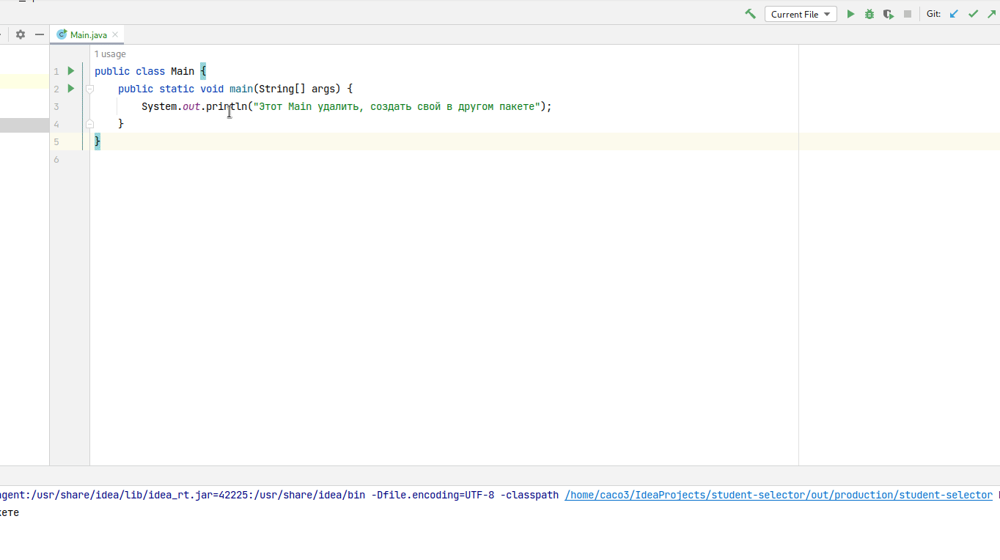

= Кто к доске

Написать программу, которая вызовет случайного студента к доске.

== Пример диалога

[source,text]
----
В группе 14 студентов.
Введите:
* next, чтобы узнать, кто пойдёт к доске
* about, чтобы узнать автора программы
* remove <фамилия>, чтобы убрать студента из выбора
* exit, чтобы выйти
Ваш выбор?

> next
К доске идёт Тэйлор Свифт
Введите «next», «remove <фамилия>», «about» или «exit»
Ваш выбор?

> next
К доске идёт Дуа Липа
Введите «next», «remove <фамилия>», «about» или «exit»
Ваш выбор?

> remove Липа
Ок, Дуа Липа к доске больше не пойдёт. В группе 13 студент(-ов)
Введите «next», «remove <фамилия>», «about» или «exit»
Ваш выбор?

> remove Грант
Такого студента нет
Введите «next», «remove <фамилия>», «about» или «exit»
Ваш выбор?

> about
Носороги в Дании не водятся. Автор программы - Робин Уильямс
Введите «next», «remove <фамилия>», «about» или «exit»
Ваш выбор?

> exit
Ты заходи, если что
----

== Дизайн

=== Класс `Student`

. Поля:
.. `String firstName` -- имя
.. `String lastName` -- фамилия
. Переопределить метод `toString`
. Не использовать `record`-класс
. Поля -- `private final`
. Добавить геттеры к полям.
.. https://www.freecodecamp.org/news/java-getters-and-setters/[«Getters and Setters in Java Explained»]

=== Класс `StudentSelector`

. Поля:
.. `List<Student>` -- список студентов
... Реализация списка -- `ArrayList`
.. `Random` -- экземпляр `Random` для генерации случайных чисел
. Методы:
.. `void addStudent(Student)` -- добавить студента для выбора
... Кинуть `StudentAlreadyExistsException`, если студент с такой фамилией есть в списке
.. `Student removeStudentByLastName(String lastName)` -- удалить студента по фамилии.
Вернуть удалённого студента или `null`, если его нет в списке
.. `boolean existsByLastName(String lastName)` -- вернёт `true`, если студент с такой фамилией существует в списке, иначе -- `false`
... Готового метода нет.
Можно найти студента, у которого фамилия совпадает с фамилией из параметра, и удалить его из списка.
Подсказки: `for`-цикл, `equals`, https://docs.oracle.com/en/java/javase/17/docs/api/java.base/java/util/List.html#remove(int)[`List#remove`]
.. `Student nextRandomStudent()` -- выбрать случайного студента из списка, вернуть `null`, если студентов в списке нет
.. `boolean hasStudents()` -- вернёт `true` если в списке есть хотя бы один студент, иначе -- `false`
.. `int count()` -- вернёт количество студентов

=== Класс `Main`

=== Поля

Полей нет

==== Методы

Все методы -- статические

|===
| # | Метод | Описание | Команда диалога

| {counter:mainMethods}
| `StudentSelector createNewStudentSelector()`
| Создать `StudentSelector` добавить в него студентов из своей группы
|

| {counter:mainMethods}
| `void about()`
| Вывести своё сообщение какое-нибудь и имя автора программы
| `about`

| {counter:mainMethods}
| `void nextStudent(StudentSelector)`
| Выбрать студента, который пойдёт к доске, вывести его имя и фамилию
| `next`

| {counter:mainMethods}
| `void unknownCommand()`
| Вывести сообщение «Неизвестная команда»
|

| {counter:mainMethods}
| `void removeStudent(String lastName, StudentSelector studentSelector)`
| Убрать студента из списка для выбора, вывести имя студента
| `remove <фамилия>`

| {counter:mainMethods}
| `void exit()`
| Вывести сообщение-прощание с пользователем и выйти
| `exit`

|===

В методе `main`:

. Создать `Scanner`
. В цикле запрашивать команды от пользователя
. На каждую команду вызывать соответствующий метод

== Доп.требования

. Настроить сборку исполняемого `jar` в Intellij IDEA
. К каждому методу и классу написать javadoc
. Настроить конфигурацию запуска Intellij IDEA
+

